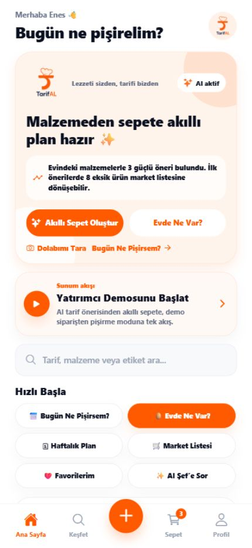
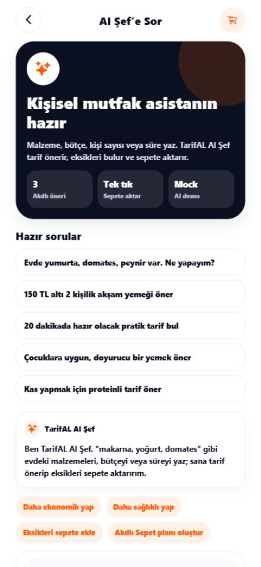
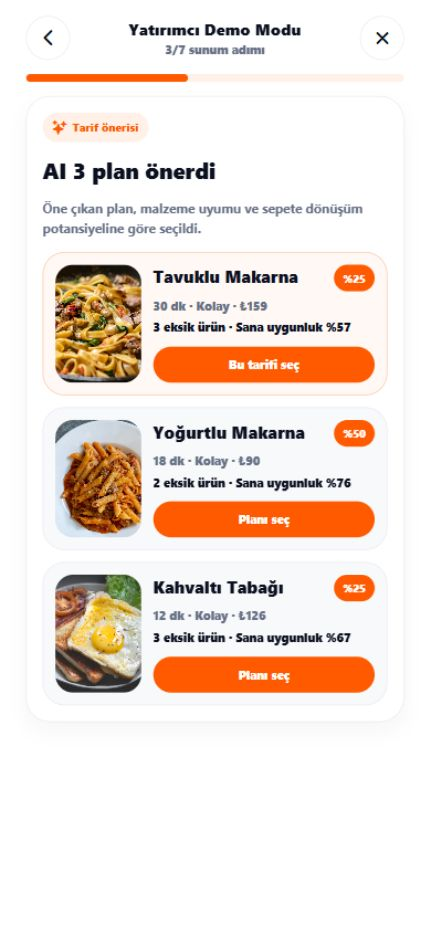
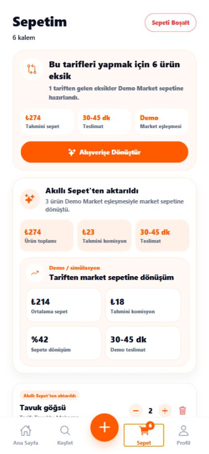
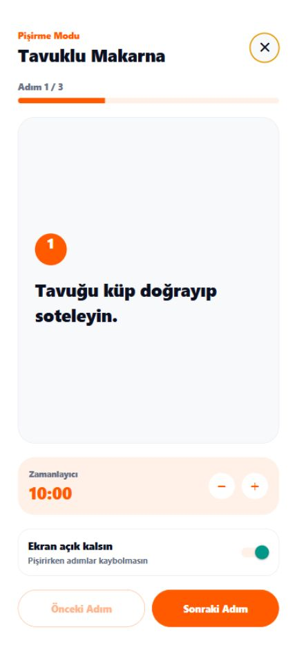
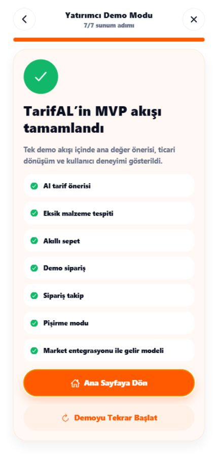
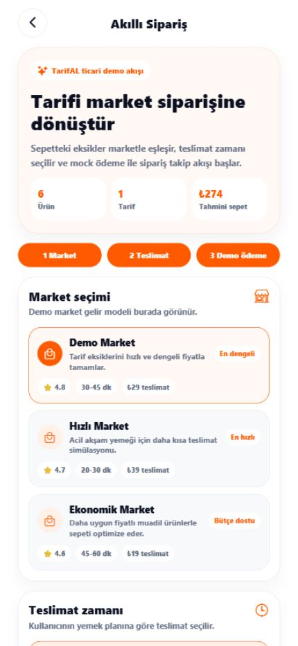
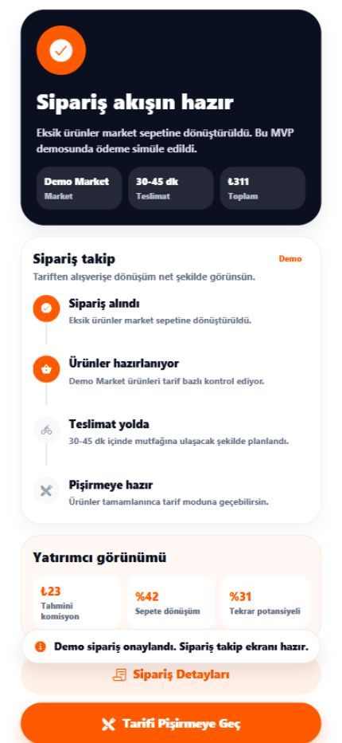
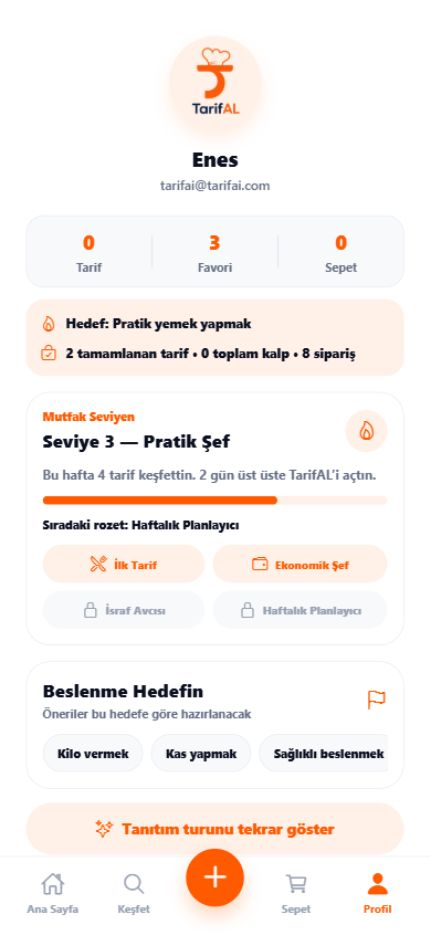

# TarifAL Yatırımcı Sunumu

> Demo MVP sunumu. Finansal projeksiyonlar tahmini ve simülasyon amaçlıdır. Demo sipariş akışı gerçek ödeme veya gerçek market siparişi oluşturmaz.

---

## SLAYT 1 - Kapak

# TarifAL

**Yapay zeka destekli tarif ve akıllı market sepeti platformu**

- Slogan: Lezzeti sizden, tarifi bizden
- Konumlandırma: TarifAL, "Bugün ne pişirsem?" sorusunu market sepeti ve pişirme sürecine bağlayan kişisel mutfak asistanıdır.
- Durum: Demo MVP sunumu

---

## SLAYT 2 - Problem

# Kullanıcı Her Gün Aynı Soruyu Soruyor: "Bugün Ne Pişirsem?"

- Evde malzeme var ama ne yapılacağı bilinmiyor.
- Tarif bulmak zaman alıyor.
- Eksik malzemeleri fark etmek zahmetli.
- Market alışverişi ayrı, tarif ayrı, pişirme ayrı ilerliyor.
- Kullanıcı karar yorgunluğu yaşıyor.

---

## SLAYT 3 - Çözüm

# TarifAL Tarif, Alışveriş ve Pişirme Sürecini Tek Akışta Toplar

- AI Şef tarif önerir.
- Eksik malzemeleri tespit eder.
- Eksikleri akıllı sepete ekler.
- Demo sipariş akışına geçirir.
- Kullanıcıyı pişirme moduna taşır.

---

## SLAYT 4 - Ürün Akışı

# Tek Akış: Malzemeden Sofraya

1. Evdeki malzemeleri gir
2. AI Şef tarif önerir
3. Eksikleri sepete ekle
4. Akıllı sipariş oluştur
5. Siparişi takip et
6. Tarifi adım adım pişir

---

## SLAYT 5 - MVP'de Çalışan Özellikler

# Bugün Çalışan MVP Özellikleri

- AI Şef demo öneri akışı
- Tarif öneri kartları
- Eksik malzeme tespiti simülasyonu
- Akıllı sepet
- Demo checkout
- Demo sipariş takip
- Pişirme modu
- Favorilere ekleme
- Toast ve modal feedback sistemi
- Mobil uyumlu demo akışı

---

## SLAYT 6 - Kullanıcı Değeri

# Kullanıcı İçin Değer

- Ne pişireceğini hızlı bulur.
- Evdeki malzemeleri daha verimli kullanır.
- Eksik ürünleri tek tıkla sepete ekler.
- Market alışverişini tarifle bağlantılı yapar.
- Pişirme adımlarını uygulama içinde takip eder.
- Zaman kazanır.
- Yemek planlama stresini azaltır.

---

## SLAYT 7 - Ticari Değer

# TarifAL Sadece Tarif Uygulaması Değil, Siparişe Dönüşen Bir Platformdur

- Tarif önerisi alışveriş niyetine dönüşür.
- Eksik malzemeler sepet değerini artırır.
- Market entegrasyonlarıyla komisyon modeli kurulabilir.
- Kullanıcı davranışına göre kişiselleştirilmiş öneriler yapılabilir.
- Marka iş birlikleri ve sponsorlu ürün önerileri eklenebilir.

---

## SLAYT 8 - Gelir Modeli

# Gelir Modeli

1. **Market sipariş komisyonu:** Tarif sepeti anlaşmalı markete yönlendiğinde sipariş başına komisyon.
2. **Premium abonelik:** Haftalık plan, aile modu, hedef bazlı öneri ve reklamsız kullanım.
3. **Sponsorlu tarif:** Markaların ürünlerini tarif içinde doğal şekilde öne çıkarma.
4. **Sponsorlu ürün:** Sepette kampanyalı veya alternatif ürün önerisi.
5. **Marka iş birlikleri:** Gıda markaları, yerel marketler ve diyetisyenlerle kampanyalar.
6. **Haftalık yemek planı paketi:** Kullanıcıya plan ve market listesi odaklı ücretli paketler.
7. **Kurumsal paketler:** İş yeri, yemekhane veya toplu yemek planlama senaryoları.

---

## SLAYT 9 - Kar-Zarar Tahmini

# Basit 12 Aylık Finansal Projeksiyon

Kaynak dosya: [tarifal-financial-model.md](../financials/tarifal-financial-model.md)

Özet metrikler gerçekçi senaryoya göre:

- 1. ay aktif kullanıcı: 500
- 12. ay aktif kullanıcı: 5.821
- 12. ay tahmini sipariş: 466
- 12. ay toplam gelir: 45.940 TL
- 12. ay net sonuç: 18.440 TL
- 12. ay kümülatif sonuç: -15.940 TL

---

## SLAYT 10 - Büyüme Planı

# MVP'den Pazara Gidiş Planı

1. MVP demo
2. Kapalı beta
3. İlk market entegrasyonu
4. İlk 1.000 kullanıcı
5. Premium plan
6. Yerel market iş birlikleri
7. Ulusal market entegrasyonları
8. Mobil uygulama yayını

---

## SLAYT 11 - Rekabet Avantajı

# TarifAL'in Farkı

- Tarif uygulaması + market sepeti birleşimi
- AI destekli öneri
- Eksik malzeme odaklı alışveriş
- Pişirme moduna kadar uçtan uca akış
- Türkiye pazarı için yerel yemek alışkanlıklarına uyarlanabilir yapı
- Demo MVP'de çalışan ana ticari akış

---

## SLAYT 12 - Kapanış

# TarifAL: Tariften Sepete, Sepetten Sofraya

- Ürün özeti: TarifAL, evdeki malzemeyi tarif önerisine ve market sepetine dönüştürür.
- Gelir modeli: Komisyon, premium abonelik, sponsorlu tarif ve marka iş birlikleri.
- Demo link alanı: `http://localhost:8081/`
- Sunum mesajı: Yatırım ve iş birliği görüşmelerine hazır MVP.

